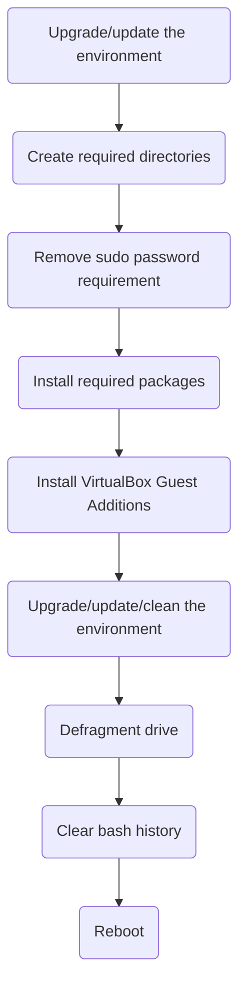

# CrispyBox

## CrispyBox.sh

```mermaid
graph TD
  EnvironmentUpdatePre("Upgrade/update the environment") --> CreateRequiredDirectories("Create required directories")
  CreateRequiredDirectories --> RemoveSudoRequirement("Remove sudo password requirement")
  RemoveSudoRequirement --> InstallRequiredPackages("Install required packages")
  InstallRequiredPackages --> InstallGuestAdditions("Install VirtualBox Guest Additions")
  InstallGuestAdditions --> EnvironmentUpdatePost("Upgrade/update/clean the environment")
  EnvironmentUpdatePost --> DefragDrive("Defragment drive")
  DefragDrive --> ClearBashHistory("Clear bash history")
  ClearBashHistory --> Reboot("Reboot")
```